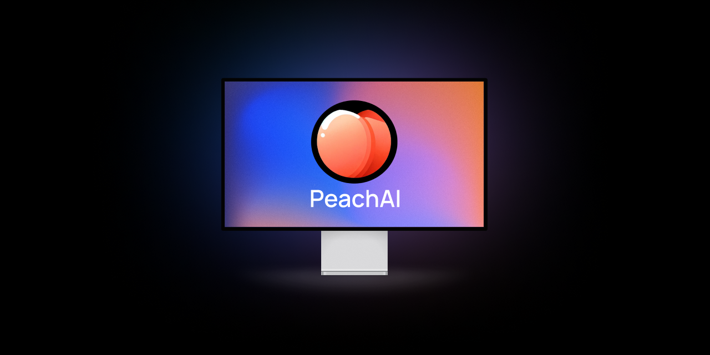

# PeachAI

Leverage local models with [LMStudio's](https://lmstudio.ai) server.

## Description
Extend [LMStudio's](https://lmstudio.ai) functionality by running prompts directly to your cursor without having to switch to the LMStudio window. Run any local model on [LMStudio's](https://lmstudio.ai) server, write a prompt, highlight your prompt and press control+shift+9 to have your keyboard emulated and the prompt sent to [LMStudio's](https://lmstudio.ai) server. The result will be streamed back to your cursor. If you would like to provide context to your prompt copy the context, write a prompt, highlight prompt, and press control+shift+8 to have your keyboard emulated and the context and prompt sent to LMStudio's server. The result will be streamed back to your cursor.

## Vision Capabilities
To use the vision capabilities of [LMStudio](https://lmstudio.ai), you will need to find an applicable model with vision capabilities running on local server. Copy the image as path to your clipboard, write prompt, highlight prompt, and press control+shift+7 to have your keyboard emulated and the prompt and image path sent to LMStudio's server. The result will be streamed back to your cursor.

## Recommended Model

- Google's Gemma 2B Instruct

## Simple Prompt

- Write your prompt
- Highlight your prompt
- Press Control+Shift+9
- The result will be streamed back to your cursor

## Prompt with Context

- Copy your context
- Write your prompt
- Highlight your prompt
- Press Control+Shift+8
- The result will be streamed back to your cursor

## Vision Capabilities
- Copy the image as path to your clipboard
- Write prompt
- Highlight prompt
- Press Control+Shift+7
- The result will be streamed back to your cursor

## Installation
- Cargo run